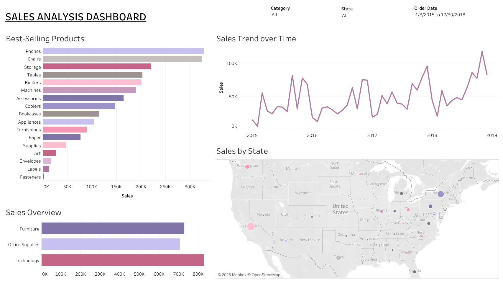

# 📊 Sales Analysis Project

This project analyzes sales performance using **Excel**, **Python**, and **Tableau** to extract business insights, understand sales trends, and visualize key performance indicators (KPIs).

---

## 📁 Dataset Overview

- Files: `sales-data.csv`, `sales-data-cleaned.xlsx`, `sales_eda.csv`
- Rows: ~10,000+, Columns: Region, Product, Date, Sales, Quantity, Profit, etc.
- Cleaned & transformed in Jupyter Notebook

---

## 🧰 Tools & Technologies

| Tool               | Usage                                  |
|--------------------|----------------------------------------|
| Python             | Data cleaning, EDA (`sales-eda.ipynb`) |
| Pandas, Matplotlib | EDA, plotting                          |
| Excel              | Preprocessing, quick metrics           |
| Tableau            | Final interactive dashboard            |

---

## 🔍 Key Insights

- 💰 **Top-performing product** 
- 🛒 **Most profitable region**
- 📉 **Sales drop-off in** 
- 📊 **Sales Trend**

---

## 📷 Visualizations

### Tableau Dashboard:

Includes:
- Regional performance overview
- Product category breakdown
- Profitability by month
- Trend lines for key KPIs

---

## 📌 File Structure

├── sales-data.csv  
├── sales-data-cleaned.xlsx    
├── sales_eda.csv  
├── sales-eda.ipynb  
├── Sales-Analysis-Dashboard.twb  
├── assets/  
  └── Dashboard.png  

---

## 🧠 What I Learned

- Cleaning large transactional datasets
- Aggregating business KPIs with Python and SQL
- Designing dashboards for storytelling and decision-making
- Structuring a professional GitHub project
